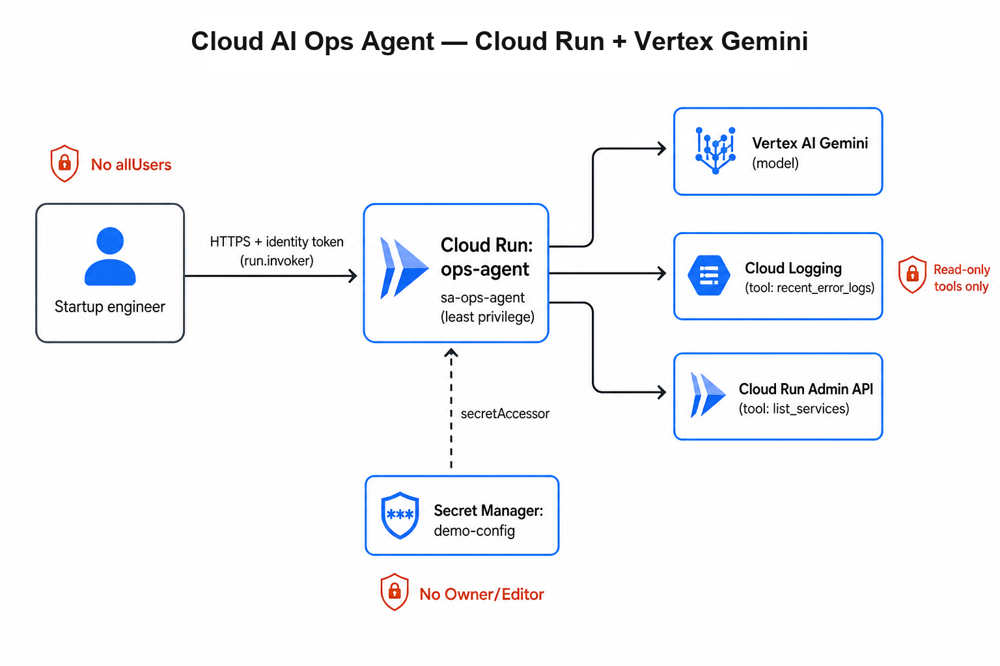

# Cloud AI Ops Agent

**What this is:** A portfolio PoC of an internal **AI ops agent** on Google Cloud. Engineers ask natural-language questions (e.g. “what’s failing?”); the agent uses **Vertex AI Gemini** with a small set of **read-only tools** to list Cloud Run services and pull recent error logs.

**Who it’s for:** Demonstrates shipping a useful Cloud AI agent **without** a public chatbot, Owner-level service accounts, or write tools — security and least privilege are part of the design, not afterthoughts.

| | |
|---|---|
| **Problem** | Ops questions shouldn’t require every engineer to have broad cloud admin access |
| **Approach** | Authenticated agent + allowlisted read-only tools + least-privilege identity |
| **Outcome** | Ask in plain English → model calls safe tools → answer grounded in live Cloud Run / logs |

### Built with

| Area | Technologies |
|------|----------------|
| **AI / LLM** | Vertex AI Gemini (`gemini-2.5-flash`), tool calling |
| **App** | Python, Cloud Run (authenticated HTTP API) |
| **Cloud / security** | IAM, least-privilege service account, Secret Manager |
| **Infra as code** | Terraform |
| **Delivery** | Docker, Artifact Registry, Cloud Build |

**Skills shown:** Cloud AI · agents & tool calling · AI security (injection / tool abuse / least privilege) · Cloud Run · Vertex AI · Secret Manager · Terraform · cost-aware demos



---

## Why this exists

Ops questions like “what’s failing?” shouldn’t require Owner on every engineer. An LLM with tools can help — but the blast radius is not a bad paragraph; it’s the model calling an API.

This PoC answers that with a governed design:

| Constraint | What this repo does |
|------------|---------------------|
| Don’t give everyone Owner | Read-only tools + viewer-style runtime SA |
| Don’t burn Free Trial on a public bot | Cloud Run requires auth — unauthenticated `POST /chat` → **403** |
| Don’t put secrets in GitHub | Secret Manager + resource-level `secretAccessor` |
| Don’t pretend production is done | Explicit security model + path beyond a demo |

---

## What you’ll find in the code

| Layer | Implementation |
|-------|----------------|
| **LLM** | Vertex AI Gemini (`gemini-2.5-flash`) in-project via Application Default Credentials — not a Google AI Studio API key |
| **Agent** | Python tool-calling loop on Cloud Run (`POST /chat`) |
| **Tools** | `list_cloud_run_services`, `recent_error_logs` — hardcoded allowlist in `app/tools.py` |
| **Identity** | Caller needs `roles/run.invoker`; runtime SA `sa-ops-agent` is least-privilege |
| **IaC** | Terraform: APIs, Artifact Registry, SA, secret, authenticated Cloud Run, invoker IAM |

---

## Architecture

1. Engineer calls `*.run.app` with an **identity token** (`roles/run.invoker`)
2. **ops-agent** runs as **`sa-ops-agent`** (not Owner/Editor)
3. Gemini may invoke only allowlisted tools:
   - `list_cloud_run_services` → Cloud Run Admin API (`roles/run.viewer`)
   - `recent_error_logs` → Cloud Logging (`roles/logging.viewer`)
4. Secret Manager mounts `demo-config` as env (accessor on **that secret only**) — demo hygiene only (see below)

| Endpoint | Purpose |
|----------|---------|
| `GET /health` | Cloud Run probes |
| `POST /chat` | `{ "message": "..." }` → tool loop → `{ "reply", "tools_used" }` |

Two identities matter: **caller** (who may invoke) vs **runtime SA** (what the agent may do). Mixing those up is how demos become incidents.

---

## Security model (what interviewers care about)

| Threat | PoC control | Residual / next step |
|--------|-------------|----------------------|
| **Prompt injection** | System prompt + hard tool allowlist in Python — model cannot invent executable tools | Injection can still skew *which* allowlisted tool runs; add filters / treat tool results as untrusted |
| **Tool abuse** | Read-only only; no delete/update/IAM tools | Viewer roles still expose inventory & logs; any write path needs human approval |
| **Data leakage / PII** | Truncated log payloads into model context | Redaction / DLP / retention before regulated data |
| **Over-privilege** | Terraform least-privilege bindings; secret IAM is resource-scoped | Narrow further per-tool where possible |
| **Quota abuse** | No `allUsers`; explicit `demo_invoker_members` | Production: IAP (or private ingress) + rate limits |
| **Secrets in image** | Vertex via ADC on the SA; config in Secret Manager | Scanning / binary authorization for production images |

**Deliberately refused in this PoC**

- Mutating tools (delete services, change IAM, stop billing)
- `roles/owner` / `roles/editor` on the runtime SA
- Public invoker “for the demo”
- Pasting production customer PII into `/chat`

Saying no is part of the design.

---

## From demo → production (sketch)

| Phase | Focus |
|-------|--------|
| **This repo** | Authenticated agent, read-only tools, least-privilege SA, Secret Manager |
| **Pilot** | Named invoker group, fixed question set, eval notes, model pinned in Terraform |
| **Production** | IAP for humans; tool allowlist + review; human approval for any write; CI/CD; DLP / VPC-SC as needed |

Write tools do not ship until a human approval path exists.

---

## Stack map

| Concept | Here |
|---------|------|
| Managed LLM | **Vertex AI** Gemini (project IAM-bound) |
| Runtime | **Cloud Run** (auth required, min instances = 0) |
| Secrets | **Secret Manager** (`demo-config` → `DEMO_CONFIG`) |
| Tool execution | Allowlisted Python functions |
| Runtime identity | Service account `sa-ops-agent` |

### Secret Manager (what this PoC actually demonstrates)

`demo-config` is **not a real secret**. Terraform stores a small non-sensitive JSON blob (`allowed_project`, `feature_flag`) so the repo can show:

- config lives outside the image / GitHub
- Cloud Run mounts it as `DEMO_CONFIG`
- IAM is **resource-scoped** (`secretAccessor` on that secret only — not project-wide)

The agent code does **not** read `DEMO_CONFIG` yet; the wiring and least-privilege IAM are the point. Swap in a real secret when you need one.

---

## Repo layout

```text
ce-cloud-ai-agent/
  README.md
  docs/architecture.png
  app/
    main.py           # HTTP API + Gemini tool-calling loop
    tools.py          # read-only allowlisted tools
    requirements.txt
  terraform/          # APIs, AR, SA, secret, Cloud Run, IAM
  scripts/
    build-and-push.sh # Cloud Build → Artifact Registry
  Dockerfile
```

---

## Prerequisites

- GCP project with billing / budgets (or Free Trial)
- `gcloud` authenticated; Terraform ≥ 1.5
- APIs enabled on `terraform apply` (`aiplatform`, `secretmanager`, `run`, …)

```bash
gcloud config set project your-gcp-project-id
gcloud config set compute/region us-central1
```

---

## Deploy

### 1. Build and push

```bash
./scripts/build-and-push.sh
```

Image: `us-central1-docker.pkg.dev/your-gcp-project-id/ai-agent/ops-agent:v1`

### 2. Terraform

```bash
cd terraform
cp terraform.tfvars.example terraform.tfvars   # set demo_invoker_members to your user
terraform init
terraform apply
```

If Artifact Registry already exists from the build script:

```bash
terraform import google_artifact_registry_repository.ai_agent \
  projects/your-gcp-project-id/locations/us-central1/repositories/ai-agent
```

Default model: `gemini-2.5-flash`. Retired ids (e.g. older Flash) may return Vertex `404 NOT_FOUND`.

### 3. Try it

```bash
# Authenticated — expect reply + tools_used
curl -H "Authorization: Bearer $(gcloud auth print-identity-token)" \
  -H "Content-Type: application/json" \
  -d '{"message":"List my Cloud Run services"}' \
  "$(cd terraform && terraform output -raw agent_url)/chat"

# Unauthenticated — expect 403
curl -sS -o /dev/null -w "%{http_code}\n" \
  -X POST -H "Content-Type: application/json" \
  -d '{"message":"hi"}' \
  "$(cd terraform && terraform output -raw agent_url)/chat"
```

---

## Cost

| Resource | Light use |
|----------|-----------|
| Cloud Run (scale to zero) | Free tier / trial credits when idle |
| Vertex Gemini Flash | Usually cents–a few dollars |
| Secret Manager / Logging / Artifact Registry | Negligible if cleaned up |
| Public unauthenticated chatbot | **Not deployed** — main cost footgun |

When idle:

```bash
cd terraform && terraform destroy
```

---

## Verify before you show it

- [ ] Authenticated chat returns a useful answer and `tools_used` shows an allowlisted tool
- [ ] Unauthenticated request returns **403**
- [ ] `sa-ops-agent` has no Owner/Editor
- [ ] Invoker is your user/group only — not `allUsers`
- [ ] `terraform destroy` when you’re done
