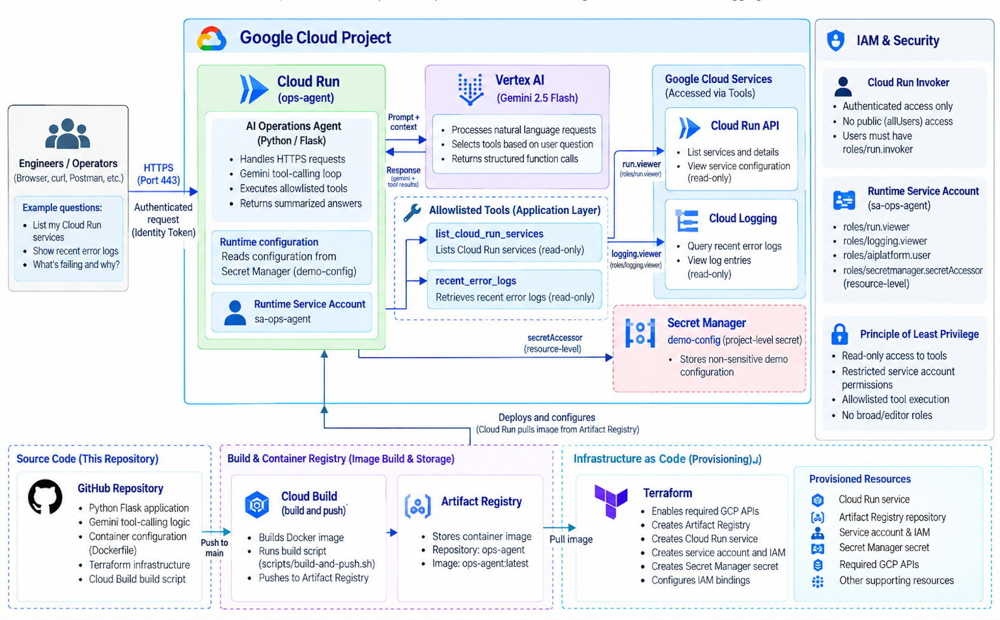

# Cloud AI Ops Agent on Google Cloud

A containerized AI operations agent that uses **Gemini tool calling to inspect Google Cloud resources through a controlled, read-only toolset**.

The application runs on **Cloud Run** and uses **Vertex AI Gemini 2.5 Flash** to interpret natural-language operational questions and determine when to invoke predefined Python functions. Rather than giving the model unrestricted access to Google Cloud, the application exposes an explicit allowlist of read-only tools backed by a dedicated least-privilege service account.

Infrastructure is provisioned with **Terraform**, while **Cloud Build** and **Artifact Registry** provide the container build and image workflow.

---


## Architecture



The architecture separates the AI reasoning layer from cloud permissions. Gemini can request an approved function call, but the Python application controls which tools can execute and the Cloud Run runtime service account determines what those tools are authorized to access.

### Architecture Highlights

- **Controlled AI Tool Execution:** Gemini selects from explicitly defined functions rather than receiving unrestricted cloud access. The application validates and executes allowlisted tools before returning results to the model for response generation.
- **Least-Privilege Security:** Cloud Run uses a dedicated `sa-ops-agent` runtime service account with read-only access to Cloud Run and Cloud Logging, plus Vertex AI access required for Gemini.
- **Authenticated Service Access:** The Cloud Run service requires authenticated callers with `roles/run.invoker`; the Terraform configuration does not grant public `allUsers` access.
- **Infrastructure as Code:** Terraform provisions Cloud Run, Artifact Registry, the runtime service account, IAM bindings, and required Google Cloud APIs.
- **Containerized Deployment:** The Flask application is packaged with Docker, built using Cloud Build, stored in Artifact Registry, and deployed to Cloud Run.

---


## How It Works

The agent provides a `/chat` endpoint that accepts natural-language questions about the Google Cloud environment.

Example requests include:

```text
List my Cloud Run services.
Show me recent error logs.
What errors are occurring?
```

The request flow is:

1. An authenticated caller sends a request to the Cloud Run `/chat` endpoint.
2. The application sends the prompt and available tool definitions to Gemini 2.5 Flash through Vertex AI.
3. Gemini determines whether an approved tool is needed and returns a structured function-call request.
4. The Python application verifies the requested function against its tool allowlist.
5. The selected function queries the Cloud Run-configured project and region (`GCP_PROJECT`, `REGION`) using the runtime service account. Gemini cannot choose a different project.
6. Tool results are returned to Gemini as structured function responses.
7. Gemini uses those results to generate the final natural-language response.

This design keeps **model reasoning separate from authorization and execution**. Gemini can choose among the capabilities exposed by the application, but IAM and the application's tool allowlist determine what actions can actually occur.

---


## Read-Only Operations Tools

The current implementation exposes two tools.

### `list_cloud_run_services()`

Uses the Cloud Run API to enumerate services in the project and region configured on Cloud Run. The tool takes no `project` or `region` arguments.

Returns:

- Service name
- Service URI
- Resource generation


### `recent_error_logs()`

Queries Cloud Logging using a configurable log filter. By default, the tool searches for entries with `severity >= ERROR`.

Returns structured information including:

- Timestamp
- Severity
- Resource type
- Message/payload content, truncated to 500 characters

Both functions are intentionally **read-only**. The current implementation does not expose deployment, deletion, configuration-change, or other mutating operations to Gemini.

---


## Security and IAM

The project uses multiple controls rather than relying on the model itself to enforce security.

### Authenticated Cloud Run Access

The Cloud Run service is not configured with a public `allUsers` invoker binding.

Authorized principals are supplied through Terraform and receive:

```text
roles/run.invoker
```

Requests therefore require Google Cloud authentication and an identity token.

### Dedicated Runtime Identity

The application runs as:

```text
sa-ops-agent
```

The service account receives:


| Role                    | Purpose                         |
| ----------------------- | ------------------------------- |
| `roles/run.viewer`      | Read Cloud Run resources        |
| `roles/logging.viewer`  | Read Cloud Logging entries      |
| `roles/aiplatform.user` | Invoke Gemini through Vertex AI |


This separates **caller identity** from **application runtime identity**.

### Tool Allowlisting

Gemini does not execute arbitrary Python functions or Google Cloud commands.

Available tools are explicitly registered by the application:

```text
list_cloud_run_services
recent_error_logs
```

A model-generated function name must match the application's allowlist before execution.

This creates two complementary authorization boundaries:

```text
Gemini tool selection
        ↓
Application allowlist
        ↓
Google Cloud IAM
```

The application controls **which operations exist**, while IAM controls **which cloud resources those operations can access**.

### Application configuration

Cloud Run supplies ordinary environment variables — not Secret Manager — because these values are not sensitive:

```text
GCP_PROJECT = <project id>
REGION      = us-central1
MODEL       = gemini-2.5-flash
```

`GCP_PROJECT` and `REGION` are authoritative. The Python tools always query that project and region. Gemini can request an approved operation (`list_cloud_run_services`, `recent_error_logs`) but cannot choose a different target.

Cloud Run authenticates Google client libraries as `sa-ops-agent` through Application Default Credentials, so no service-account key is stored.

---


## Infrastructure as Code

Terraform manages the Google Cloud infrastructure under:

```text
terraform/
```

The configuration provisions:

- Required Google Cloud APIs
- Artifact Registry repository
- Cloud Run service
- Dedicated runtime service account
- Project-level IAM required by the agent
- Cloud Run invoker permissions

Variables keep project-specific configuration outside the reusable Terraform resources.

An example configuration is provided in:

```text
terraform/terraform.tfvars.example
```

Terraform state and local variable files should remain outside version control.

---


## Build and Deployment

Application container builds are intentionally separate from Terraform infrastructure provisioning.

The helper script:

```bash
./scripts/build-and-push.sh
```

uses Cloud Build to build the Docker image and push it to Artifact Registry.

The default image path follows:

```text
us-central1-docker.pkg.dev/<PROJECT_ID>/ai-agent/ops-agent:v1
```

Terraform configures Cloud Run to use the corresponding Artifact Registry image.

This repository does **not** currently implement an automated GitHub-triggered CI/CD pipeline; image builds are initiated manually/on demand.

---


## Repository Structure

```text
.
├── app/
│   ├── __init__.py
│   ├── main.py
│   ├── tools.py
│   └── requirements.txt
├── scripts/
│   └── build-and-push.sh
├── terraform/
│   ├── apis.tf
│   ├── artifact_registry.tf
│   ├── cloud_run.tf
│   ├── iam.tf
│   ├── outputs.tf
│   ├── providers.tf
│   ├── service_account.tf
│   ├── terraform.tfvars.example
│   ├── variables.tf
│   └── versions.tf
├── Dockerfile
├── .gitignore
├── Cloud_AI_Ops_Agent.png
└── README.md
```

---


## Deploying the Project


### Prerequisites

- Google Cloud project
- Google Cloud CLI (`gcloud`)
- Terraform
- Permissions to create the required Google Cloud resources

Authenticate Google Cloud:

```bash
gcloud auth login
gcloud auth application-default login
```

Create a local Terraform variables file:

```bash
cd terraform
cp terraform.tfvars.example terraform.tfvars
```

Update the values for your Google Cloud project and authorized invoker.

### Build the Container

From the repository root:

```bash
./scripts/build-and-push.sh
```

This submits the application to Cloud Build and stores the resulting image in Artifact Registry.

### Provision the Infrastructure

```bash
cd terraform

terraform init
terraform plan
terraform apply
```

After deployment, Terraform outputs the Cloud Run service URL.

### Call the Agent

Obtain an identity token:

```bash
TOKEN=$(gcloud auth print-identity-token)
```

Send an authenticated request:

```bash
curl -X POST "$SERVICE_URL/chat" \
  -H "Authorization: Bearer $TOKEN" \
  -H "Content-Type: application/json" \
  -d '{"message":"List my Cloud Run services"}'
```

---


## Portfolio Scope vs. Production Considerations

This project is a focused architecture implementation demonstrating **Gemini tool calling, controlled cloud operations, least-privilege IAM, serverless container deployment, and Terraform-based infrastructure management**.

For a larger production deployment, additional considerations could include:

- Automated CI/CD with controlled promotion between environments
- Automated Terraform validation and deployment workflows
- Expanded application metrics, dashboards, and alerting
- Audit and monitoring controls around agent/tool execution
- Additional authorization controls for different users or tool capabilities
- Input/output guardrails appropriate to the operational use case
- Broader error handling and retry strategies
- Additional tools with carefully scoped permissions
- Separate development, staging, and production environments

These are intentionally presented as **future production considerations**, not capabilities implemented by the current repository.

---


## Technologies

**Google Cloud:** Cloud Run · Vertex AI · Gemini 2.5 Flash · Cloud Logging · Artifact Registry · Cloud Build · IAM

**Infrastructure & Application:** Terraform · Docker · Python · Flask · Google Cloud SDKs